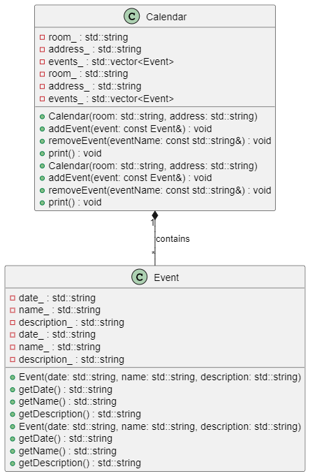

# Лабораторная работа №1

## Тема: Создание классов и объектов

**Выполнил:** Цапаев Д.Д  
**Курс:** 2  
**Группа:** ПИЖ-б-о-23-2  

***

## 1. Введение

Код реализует систему управления событиями в календаре для конкретного помещения. Состоит из двух классов:

- `Event` - описывает отдельное событие
- `Calendar` - управляет коллекцией событий для конкретной локации

## 2. Структура классов

### 2.1 Класс Event

**Назначение**: Хранение информации об отдельном событии.

**Поля**:

| Поле | Тип | Описание |
|------|-----|----------|
| `date_` | `std::string` | Дата проведения события |
| `name_` | `std::string` | Название события |
| `description_` | `std::string` | Подробное описание |

**Методы**:

```cpp
// Конструктор
Event(std::string date, std::string name, std::string description)

// Геттеры
std::string getDate() const
std::string getName() const
std::string getDescription() const
```

### 2.2 Класс Calendar

**Назначение**: Управление событиями для конкретного помещения.

**Поля**:

| Поле | Тип | Описание |
|------|-----|----------|
| `room_` | `std::string` | Название помещения |
| `address_` | `std::string` | Физический адрес |
| `events_` | `std::vector<Event>` | Коллекция событий |

**Методы**:

```cpp
// Конструктор
Calendar(std::string room, std::string address)

// Основные методы
void addEvent(const Event& event)
void removeEvent(const std::string& eventName)
void print() const
```

## 3. Особенности реализации

### 3.1 Хранение данных

- Используется `std::vector` для хранения событий
- Все строковые данные хранятся в `std::string`
- Отсутствие ручного управления памятью (нет `new`/`delete`)

### 3.2 Ключевые методы

**1. Добавление события**:

```cpp
events_.push_back(event);
```

Простое добавление в конец вектора

**2. Удаление события**:

- Итерация по вектору с проверкой имени
- Использование `vector::erase()` с коррекцией итератора

**3. Вывод информации**:

- Форматированный вывод с разделителями
- Нумерация событий
- Табличное представление данных

## 4. Пример использования

```cpp
int main() {
    Calendar confRoom("Conference Hall", "123 Main St, TechPark");
    
    confRoom.addEvent(Event(
        "2024-10-15 10:00",
        "Project Planning",
        "Quarterly project roadmap discussion"
    ));
    
    confRoom.addEvent(Event(
        "2024-10-16 14:30",
        "Client Demo",
        "Presentation of new features"
    ));
    
    confRoom.print();
    
    confRoom.removeEvent("Client Demo");
    confRoom.print();
}
```

## 5. Диаграмма классов


