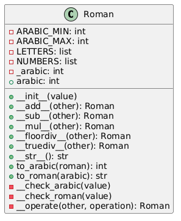
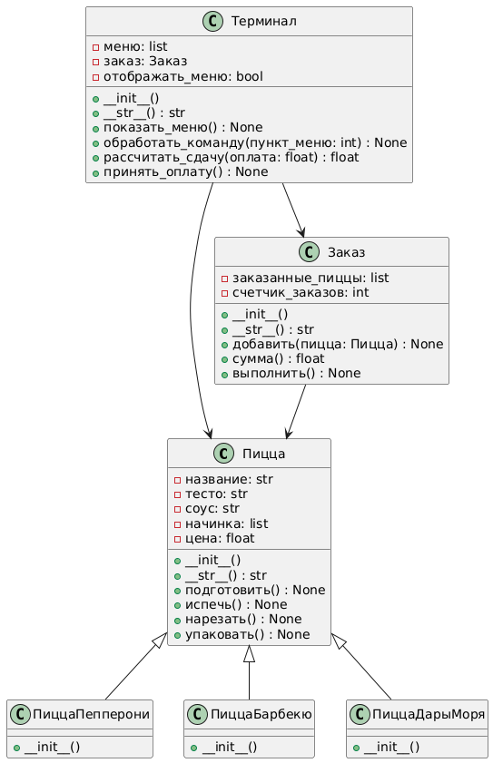

# Вариант 7

## Задание 1. "Римское число"

### Описание класса

Класс `Roman` реализует работу с римскими числами и позволяет выполнять арифметические операции с ними. Он поддерживает преобразование римских чисел в арабские и наоборот. Ограничение на значения: римские числа должны находиться в диапазоне от 1 до 3999.

### Атрибуты класса

- `ARABIC_MIN`: Минимальное арабское число (1).
- `ARABIC_MAX`: Максимальное арабское число (3999).
- `LETTERS`: Список римских символов.
- `NUMBERS`: Список арабских значений, соответствующих римским символам.
- `_arabic`: Хранит текущее арабское значение римского числа.

### Методы класса

#### Конструктор

- `__init__(value: Union[int, str]) -> None`
  - Создает экземпляр класса `Roman`.
  - **Параметры**:
    - `value`: Значение римского числа, может быть арабским числом или строкой.
  - **Исключения**:
    - `TypeError`: Если значение не является арабским числом или строкой.

#### Арифметические операции

- `__add__(other: Union["Roman", int]) -> "Roman"`
  - Складывает текущее римское число с другим римским числом или арабским числом.

- `__sub__(other: Union["Roman", int]) -> "Roman"`
  - Вычитает из текущего римского числа другое римское число или арабское число.

- `__mul__(other: Union["Roman", int]) -> "Roman"`
  - Умножает текущее римское число на другое римское число или арабское число.

- `__floordiv__(other: Union["Roman", int]) -> "Roman"`
  - Выполняет целочисленное деление текущего римского числа на другое римское число или арабское число.

- `__truediv__(other: Union["Roman", int]) -> "Roman"`
  - Выполняет деление текущего римского числа на другое римское число или арабское число.

#### Преобразование

- `to_arabic(roman: Union[str, "Roman"]) -> int`
  - Преобразует римское число в арабское.
  - **Исключения**:
    - `ValueError`: Если римское число содержит недопустимые символы.

- `to_roman(arabic: int) -> str`
  - Преобразует арабское число в римское.
  - **Исключения**:
    - `ValueError`: Если арабское число не находится в допустимом диапазоне.

### UML-диаграмма классов

## Задание 2. "Пиццерия"

## Описание классов

### 1. Класс `Пицца`
Класс `Пицца` содержит общие атрибуты и методы для всех видов пиццы. Дочерние классы будут их конкретизировать.

#### Атрибуты:
- `название` (str): Название пиццы.
- `тесто` (str): Тип теста (тонкое или пышное).
- `соус` (str): Тип соуса (кетчуп или другой).
- `начинка` (list): Список начинок (по умолчанию пустой).
- `цена` (float): Цена пиццы.

#### Методы:
- `__init__()`: Конструктор класса, инициализирует атрибуты пиццы.
- `__str__() -> str`: Возвращает строковое представление пиццы.
- `подготовить() -> None`: Сообщает о процессе подготовки пиццы.
- `испечь() -> None`: Сообщает о процессе запекания пиццы.
- `нарезать() -> None`: Сообщает о процессе нарезки пиццы.
- `упаковать() -> None`: Сообщает о процессе упаковки пиццы.

---

### 2. Класс `ПиццаПепперони`
Класс `ПиццаПепперони` наследует от класса `Пицца` и конкретизирует его атрибуты для пиццы Пепперони.

#### Атрибуты:
- Переопределяет:
  - `название`: "Пепперони"
  - `тесто`: "тонкое"
  - `соус`: "томатный"
  - `начинка`: ["пепперони", "сыр моцарелла"]
  - `цена`: 350.00

---

### 3. Класс `ПиццаБарбекю`
Класс `ПиццаБарбекю` наследует от класса `Пицца` и конкретизирует его атрибуты для пиццы Барбекю.

#### Атрибуты:
- Переопределяет:
  - `название`: "Барбекю"
  - `тесто`: "пышное"
  - `соус`: "барбекю"
  - `начинка`: ["курица", "лук", "сыр моцарелла"]
  - `цена`: 400.00

---

### 4. Класс `ПиццаДарыМоря`
Класс `ПиццаДарыМоря` наследует от класса `Пицца` и конкретизирует его атрибуты для пиццы Дары Моря.

#### Атрибуты:
- Переопределяет:
  - `название`: "Дары Моря"
  - `тесто`: "тонкое"
  - `соус`: "чесночный"
  - `начинка`: ["креветки", "мидии", "сыр моцарелла"]
  - `цена`: 450.00

---

### 5. Класс `Заказ`
Класс `Заказ` содержит информацию о заказе, включая список пицц и их сумму.

#### Атрибуты:
- `заказанные_пиццы` (list): Список экземпляров класса `Пицца`.
- `счетчик_заказов` (int): Счетчик для определения номера заказа.

#### Методы:
- `__init__()`: Конструктор класса, инициализирует атрибуты заказа.
- `__str__() -> str`: Возвращает строковое представление заказа.
- `добавить(пицца) -> None`: Добавляет пиццу в заказ.
- `сумма() -> float`: Возвращает сумму заказа.
- `выполнить() -> None`: Выполняет заказ, последовательно готовя каждую пиццу.

---

### 6. Класс `Терминал`
Класс `Терминал` обеспечивает взаимодействие с клиентом, управляет меню и обрабатывает команды.

#### Атрибуты:
- `меню` (list): Список доступных пицц.
- `заказ` (Заказ): Текущий заказ клиента.
- `отображать_меню` (bool): Флаг для отображения меню.

#### Методы:
- `__init__()`: Конструктор класса, инициализирует атрибуты терминала.
- `__

## UML-диаграмма классов

