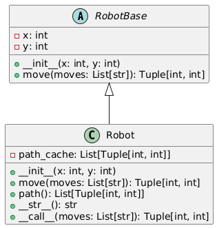

# Вариант 7

## Задание. Класс «Robot»

Класс инициализируется начальными координатами — положением Робота на
плоскости, обе координаты заключены в пределах от 0 до 100.

Робот может передвигаться на одну клетку вверх (N), вниз (S), вправо (E), влево (W).
Выйти за границы плоскости Робот не может.

Метод move() принимает строку — последовательность команд перемещения робота,
каждая буква строки соответствует перемещению на единичный интервал в направлении,
указанном буквой. Метод возвращает список координат — конечное положение Робота
после перемещения.

Метод path() вызывается без аргументов и возвращает список координат точек, по
которым перемещался Робот при последнем вызове метода move(). Если метод не
вызывался, возвращает список с начальным положением Робота.

# Отчет

## Абстракция: 
 - Класс RobotBase является абстрактным классом, который определяет общую структуру и поведение для всех роботов. 
 - Метод move является абстрактным методом, который должен быть реализован в дочерних классах.

```py
# robot.py

from abc import ABC, abstractmethod

class RobotBase(ABC):

    def __init__(self, x, y):

        self.__x = x
        self.__y = y

    @abstractmethod
    def move(self, moves):
        pass
```

## Наследование: 
- Класс Robot наследует класс RobotBase и расширяет его функциональность. Он реализует абстрактный метод move и добавляет дополнительные методы и свойства.

```py
# robot.py

def __init__(self, x: int, y: int):

        if (0 <= x <= 100) and (0 <= y <= 100):
            super().__init__(x, y)
            self.__path_cache = [(self._RobotBase__x, self._RobotBase__y)]
        else:
            raise ValueError("Робот должен располагаться в пределах диапазона")

    def move(self, moves: List[str]) -> Tuple[int, int]:

        for m in moves:
            if (self._RobotBase__x > 100) or (self._RobotBase__y > 100):
                raise ValueError("Робот выходит за границы диапазона")
            if m == "N":
                self._RobotBase__y += 1
            elif m == "S":
                self._RobotBase__y -= 1
            elif m == "W":
                self._RobotBase__x -= 1
            elif m == "E":
                self._RobotBase__x += 1
            elif m == "":
                continue
            else:
                raise ValueError("Неверный символ!")

            self.__path_cache.append((self._RobotBase__x, self._RobotBase__y))

        return self.__path_cache[-1]
        
# ...
```

## Инкапсуляция: 
- В классе RobotBase координаты x и y объявлены как приватные атрибуты (__x и __y). Это означает, что они не могут быть доступны напрямую извне класса. Вместо этого, для доступа к этим атрибутам используются методы класса.

```py
# robot.py

class RobotBase(ABC):

    def __init__(self, x, y):

        self.__x = x
        self.__y = y
# ...
```

- В классе Robot также используются приватные атрибуты (__path_cache), которые хранят путь, пройденный роботом. Этот атрибут также не может быть доступен напрямую извне класса, и для доступа к нему используется метод path().

```py
# robot.py

class Robot(RobotBase):

    def __init__(self, x, y):

        if (0 <= x <= 100) and (0 <= y <= 100):
            super().__init__(x, y)
            self.__path_cache = [(self._RobotBase__x, self._RobotBase__y)]
        else:
            raise ValueError("Робот должен располагаться в пределах диапазона")
# ...
```

## Полиморфизм: 
- Класс Robot может быть использован в любом месте, где ожидается объект класса RobotBase, поскольку он наследует от него и реализует его абстрактные методы.

```py
# main.py

from robot import Robot

if __name__ == "__main__":
    robot = Robot(0, 0)
    robot.move("WWWSSSNNNEEE")
    print(robot.path())
```

- Используется перегрузка стандартного метода __str__, который возвращает строковое представление робота в формате Robot(x=..., y=...).

```py
# robot.py

    def __str__(self) -> str:
        return f"Robot(x={self._RobotBase__x}, y={self._RobotBase__y})"
```

## Вызываемый метод __call__
- Класс Robot содержит метод __call__, который принимает параметр moves и вызывает метод move для перемещения робота по командам. Это позволяет создавать экземпляры класса Robot и вызывать их как функции для перемещения робота.

```py
# robot.py 

    def __call__(self, moves: List[str]) -> Tuple[int, int]:
        return self.move(moves)
```

## Аннотирование типов
- В коде применяется аннотирование типов для указания ожидаемых типов данных для параметров функций и возвращаемых значений. 

```py
class RobotBase(ABC):

    def __init__(self, x: int, y: int):
        # ...
    
    @abstractmethod
    def move(self, moves: List[str]) -> Tuple[int, int]:
        pass
# ...


class Robot(RobotBase):

    def __init__(self, x: int, y: int):
        # ...

    def move(self, moves: List[str]) -> Tuple[int, int]:
        # ...

    def path(self) -> List[Tuple[int, int]]:
        # ...

    def __str__(self) -> str:
        # ...

    def __call__(self, moves: List[str]) -> Tuple[int, int]:
        # ...
```

# UML-диаграмма классов

