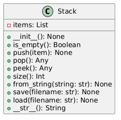

# Задание 1. "Срочные вклады"


## Вариант 7

### Описание класса

Класс `TimeDeposit` и его наследники реализуют работу с срочными вкладами. Он позволяет управлять различными типами вкладов, рассчитывать прибыль и итоговую сумму по вкладу с учетом различных условий.

### Атрибуты класса

- `name (str)`: Наименование вклада.
- `_interest_rate (float)`: Процентная ставка по вкладу (в диапазоне от 0 до 100].
- `_period_limit (tuple (int, int))`: Допустимый срок вклада в месяцах [от; до).
- `_sum_limit (tuple (float, float))`: Допустимая сумма вклада [от; до).
- `currency (str)`: Валюта вклада.

### Методы класса

#### Конструктор

- `__init__(name: str, interest_rate: float, period_limit: Tuple[int, int], sum_limit: Tuple[float, float]) -> None`
  - Инициализирует атрибуты класса и проверяет корректность значений.

#### Строковое представление

- `__str__() -> str`
  - Возвращает строковое представление вклада с указанием всех его атрибутов.

#### Проверка значений

- `_check_self() -> None`
  - Проверяет, что значения атрибутов соответствуют установленным ограничениям.

- `_check_user_params(initial_sum: float, period: int) -> None`
  - Проверяет, что параметры пользователя соответствуют ограничениям вклада.

#### Расчет прибыли и суммы

- `get_profit(initial_sum: float, period: int) -> float`
  - Возвращает прибыль по вкладу на основе первоначальной суммы и срока.

- `get_sum(initial_sum: float, period: int) -> float`
  - Возвращает итоговую сумму по вкладу, включая прибыль.

### Наследники

#### Класс `BonusTimeDeposit`

- Наследует от `TimeDeposit` и добавляет возможность начисления бонуса к прибыли, если вклад превышает определенную сумму.

- Атрибуты:
  - `_bonus (dict)`: Словарь с процентом от прибыли и минимальной суммой для начисления бонуса.

- Методы:
  - Переопределяет методы для проверки и расчета прибыли с учетом бонуса.

#### Класс `CompoundTimeDeposit`

- Наследует от `TimeDeposit` и добавляет возможность ежемесячной капитализации процентов.

- Методы:
  - Переопределяет метод `get_profit` для расчета прибыли с учетом капитализации.

### Пример использования

```python
deposits_data = dict(interest_rate=5, period_limit=(6, 18), sum_limit=(1000, 100000))

deposits = (
    TimeDeposit("Сохраняй", interest_rate=5, period_limit=(6, 18), sum_limit=(1000, 100000)),
    BonusTimeDeposit("Бонусный 2", **deposits_data, bonus=dict(percent=5, sum=2000)),
    CompoundTimeDeposit("С капитализацией", **deposits_data),
    BonusTimeDeposit("Бонусный 3", **deposits_data, bonus=dict(percent=7, sum=3000)),
    CompoundTimeDeposit("Вклад с Капитализацией 2", **deposits_data),
)
```

### UML-диаграмма классов


# Задание 2. "Простой класс"


## Описание класса

Класс `Stack` реализует структуру данных "стек", работающую по принципу LIFO (последний пришёл — первый вышел). Он предоставляет методы для добавления, удаления и доступа к элементам.

## Атрибуты класса

- `items (list)`: Список, хранящий элементы стека.

## Методы класса

### Конструктор

- `__init__() -> None`
  - Инициализирует пустой стек.

### Проверка состояния

- `is_empty() -> bool`
  - Проверяет, пуст ли стек.

### Основные операции

- `push(item) -> None`
  - Добавляет элемент на вершину стека.

- `pop()`
  - Удаляет и возвращает элемент с вершины стека. Выбрасывает исключение, если стек пуст.

- `peek()`
  - Возвращает элемент с вершины стека без его удаления. Выбрасывает исключение, если стек пуст.

- `size() -> int`
  - Возвращает количество элементов в стеке.

### Строковое представление

- `__str__() -> str`
  - Возвращает строковое представление стека.

## Пример использования

```python
stack = Stack()
stack.push(1)
stack.push(2)
stack.push(3)
print(stack)  # Stack(3, 2, 1)
print(stack.pop())  # 3
print(stack.peek())  # 2
print(stack.size())  # 2
print(stack)  # Stack(2, 1)
```

### UML-диаграмма классов
