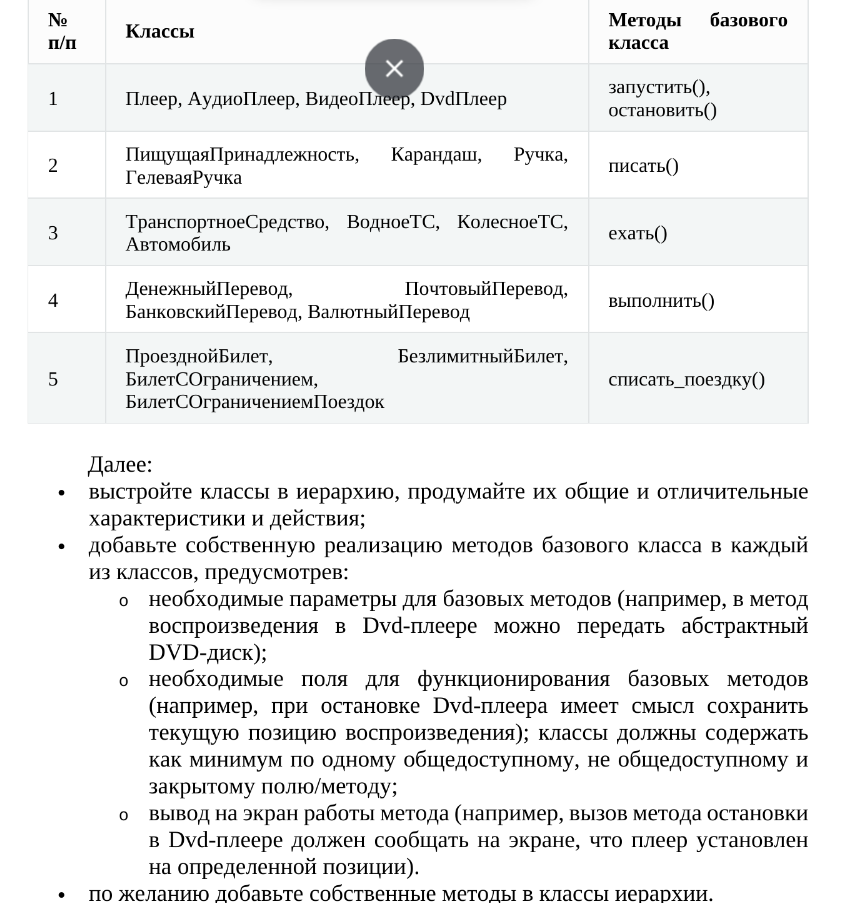
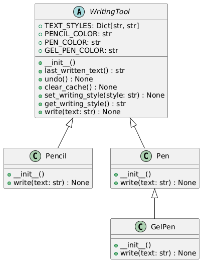

# Задание 1. Класс-контейнер
## Вариант 7


## Описание
Класс `StackCollection` реализует контейнер для хранения объектов класса `Stack`. Он предоставляет методы для добавления, удаления, сохранения и загрузки стеков.

## Методы

### `__init__(self) -> None`
Инициализация контейнера, который хранит список стеков.

### `__str__(self) -> str`
Возвращает строковое представление контейнера, показывающее количество стеков и их содержимое.

### `__getitem__(self, index: int) -> Stack`
Позволяет использовать индексацию для доступа к элементам контейнера.

#### Параметры:
- `index`: индекс элемента.

### `add(self, value: Stack) -> None`
Добавляет объект `Stack` в контейнер.

#### Параметры:
- `value`: объект `Stack`, который нужно добавить.

### `remove(self, index: int) -> None`
Удаляет элемент из контейнера по индексу.

#### Параметры:
- `index`: индекс элемента, который нужно удалить.

### `save(self, filename: str) -> None`
Сохраняет содержимое контейнера в JSON-файл.

#### Параметры:
- `filename`: имя файла для сохранения.

### `load(self, filename: str) -> None`
Загружает содержимое из JSON-файла и создает объекты `Stack`.

#### Параметры:
- `filename`: имя файла для загрузки.

## Пример использования
```python
stack_collection = StackCollection()
stack_collection.add(Stack())
stack_collection.save("stacks.json")
stack_collection.load("stacks.json")
print(stack_collection)
```

### UML-диаграмма классов


# Задание 2. Иерархия классов


## Краткая теоретическая справка
ANSI Escape Codes — это последовательности символов, которые используются для управления форматированием текста в терминалах. Они позволяют изменять цвет текста, цвет фона, а также применять различные стили, такие как жирный, подчеркнутый и т.д. Эти коды обычно начинаются с символа ESC (код 27 в ASCII), за которым следует последовательность, описывающая желаемое форматирование.

Основные компоненты ANSI Escape Codes
ESC: Начало последовательности. В Python это обычно представляется как \033 или \e.

Коды: После ESC следует код, который определяет действие. Например, указывает на начало формата.

Параметры: После могут следовать один или несколько параметров, разделенных точкой с запятой (;), которые определяют конкретные стили или цвета.

Завершающий символ: Последовательность заканчивается символом, который указывает, что форматирование завершено. Например, m используется для изменения цвета текста.

## Описание

- **Класс WritingTool**: Это абстрактный класс, который определяет общие методы и атрибуты для всех инструментов письма. Он использует словарь `TEXT_STYLES` для управления стилями текста и инкапсулирует стек для хранения текста.
  
- **Класс Pencil**: Наследует от `WritingTool` и реализует метод `write`, который выводит текст с использованием стиля и цвета, соответствующего карандашу.

- **Класс Pen**: Также наследует от `WritingTool` и реализует метод `write`, который выводит текст с использованием стиля и цвета, соответствующего ручке.

- **Класс GelPen**: Наследует от `Pen`, переопределяет стиль письма и реализует метод `write`, который выводит текст с использованием стиля и цвета, соответствующего гелевой ручке.

1. **WritingTool (абстрактный класс)**
   - Описание: Определяет основные методы и атрибуты для всех инструментов для письма.
   - Методы:
     - `last_written_text()`: Возвращает последний записанный текст.
     - `undo()`: Отменяет последнее действие.
     - `clear_cache()`: Очищает стек записанного текста.
     - `set_writing_style(style: str)`: Устанавливает стиль письма.
     - `get_writing_style()`: Возвращает текущий стиль письма.
     - `write(text: str)`: Абстрактный метод, который должен быть реализован в подклассах.

2. **Pencil (наследник WritingTool)**
   - Описание: Представляет письменную принадлежность в виде карандаша.
   - Методы:
     - `write(text: str)`: Реализует запись текста с использованием карандаша.

3. **Pen (наследник WritingTool)**
   - Описание: Представляет письменную принадлежность в виде ручки.
   - Методы:
     - `write(text: str)`: Реализует запись текста с использованием ручки.

4. **GelPen (наследник Pen)**
   - Описание: Представляет письменную принадлежность в виде гелевой ручки.
   - Методы:
     - `write(text: str)`: Реализует запись текста с использованием гелевой ручки.

### UML-диаграмма классов
