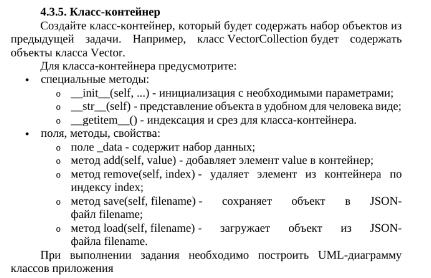
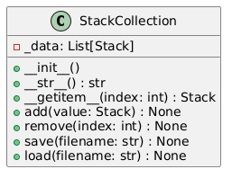

# Класс-контейнер
## Вариант 7


## Описание
Класс `StackCollection` реализует контейнер для хранения объектов класса `Stack`. Он предоставляет методы для добавления, удаления, сохранения и загрузки стеков.

## Методы

### `__init__(self) -> None`
Инициализация контейнера, который хранит список стеков.

### `__str__(self) -> str`
Возвращает строковое представление контейнера, показывающее количество стеков и их содержимое.

### `__getitem__(self, index: int) -> Stack`
Позволяет использовать индексацию для доступа к элементам контейнера.

#### Параметры:
- `index`: индекс элемента.

### `add(self, value: Stack) -> None`
Добавляет объект `Stack` в контейнер.

#### Параметры:
- `value`: объект `Stack`, который нужно добавить.

### `remove(self, index: int) -> None`
Удаляет элемент из контейнера по индексу.

#### Параметры:
- `index`: индекс элемента, который нужно удалить.

### `save(self, filename: str) -> None`
Сохраняет содержимое контейнера в JSON-файл.

#### Параметры:
- `filename`: имя файла для сохранения.

### `load(self, filename: str) -> None`
Загружает содержимое из JSON-файла и создает объекты `Stack`.

#### Параметры:
- `filename`: имя файла для загрузки.

## Пример использования
```python
stack_collection = StackCollection()
stack_collection.add(Stack())
stack_collection.save("stacks.json")
stack_collection.load("stacks.json")
print(stack_collection)
```

### UML-диаграмма классов
